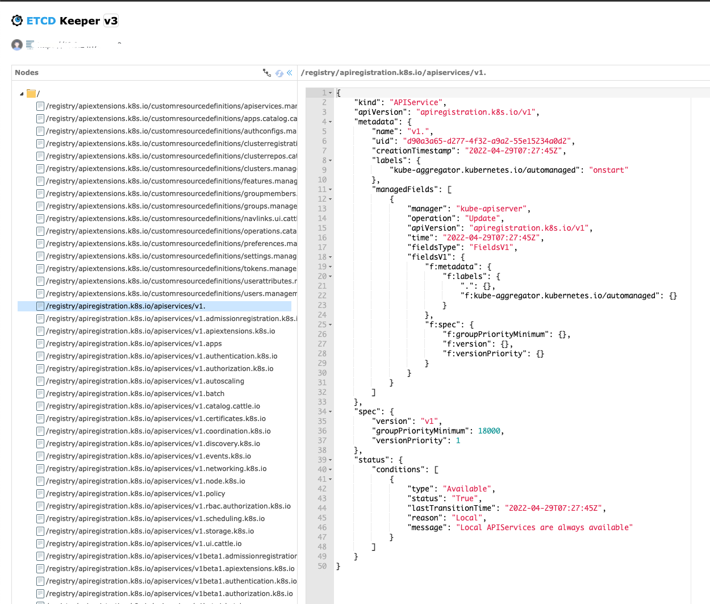

## K8S ETCD Keeper

The native [etcd-keeper](https://github.com/evildecay/etcdkeeper) needs etcd to **enable auth mode**, but if the etcd of k8s has auth enabled, **there cloud be some problems**(never try on the production cluster). In order to observe the kv pairs of etcd, this project is revised for a little and added another parameter `-k8sMode true`, which allows etcd-keeper to connect to the etcd cluster of k8s through tls mode. 

Refer:

1. ["etcdctl auth enable" command breaks Kubernetes cluster](https://github.com/etcd-io/etcd/issues/8458)
2. [从安全的角度谈谈etcd](http://dockone.io/article/2434389)

examples:




---


## ETCD Keeper
* Lightweight etcd web client.
* Support etcd 2.x and etcd 3.x.
* The server uses the etcd go client interface, and the server compiles with the etcd client package.
* Based easyui framework to achieve(easyui license [easyui website](http://www.jeasyui.com)).

## Usage
* Run etcdkeeper.exe (windows version)
* Run etcdkeeper.exe -auth (If enable etcd authentication)
* [Download other platform releases](https://github.com/evildecay/etcdkeeper/releases).
```
  Usage of etcdkeeper.exe:
  -h string
        host name or ip address (default: "0.0.0.0", the http server addreess, not etcd address)
  -p int
        port (default 8080)
  -sep string
        Separator (default "/")
  -usetls
        use tls (only v3)
  -cacert string
        verify certificates of TLS-enabled secure servers using this CA bundle (only v3)
  -cert string
        identify secure client using this TLS certificate file (only v3)
  -key string
        identify secure client using this TLS key file (only v3)
  -auth bool
        use etcd auth
  -timeout int
        ETCD client connect timeout
```
* Open your browser and enter the address: http://127.0.0.1:8080/etcdkeeper
* Click on the version of the title to select the version of ETCD. The default is V3. Reopening will remember your choice.
* Right click on the tree node to add or delete.
* Get data based on etcd user permissions.
  - Just display the list according to the configured permissions, and there will be time to add the configuration permission features.
  - Each time you restart etcdkeeper, you need to enter the root username and password for each etcd server address.
  - [enable etcdv3 authentication](https://github.com/etcd-io/etcd/blob/master/Documentation/op-guide/authentication.md)
  - [enable etcdv2 authentication](https://github.com/etcd-io/etcd/blob/master/Documentation/v2/authentication.md)
* Display the status information of etcd, version, data size.
* Etcd address can be modified by default to the localhost. If you change, press the Enter key to take effect.

## Features
* Etcd client view, Add, update or delete nodes.
* Content edits use the ace editor([Ace editor](https://ace.c9.io)). Support toml,ini,yaml,json,xml and so on to highlight view.
* Content format. (Currently only support json, Other types can be extended later) Thanks jim3ma for his contribution.[@jim3ma]( https://github.com/jim3ma)

## Work in progress
* Add import and export features.  **(delay)**

## Special Note
Because the etcdv3 version uses the new storage concept, without the catalog concept, the client uses the previous default "/" delimiter to view. See the documentation for etcdv3 [clientv3 doc](https://godoc.org/github.com/coreos/etcd/clientv3).

## Docker
Etdkeeper official image. (https://hub.docker.com/r/evildecay/etcdkeeper)

## Screenshots


## Demo


## License
MIT
